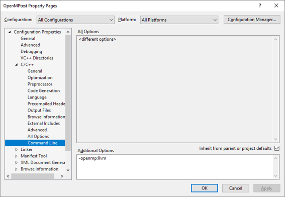

---
title: "Lab 3 - OpenMP"
author:
- \small COM4521/COM6521 - Parallel Computing with Graphical Processing Units (GPUs)
keywords:
- Lab
- COM4521
- COM6521
- University of Sheffield
subject: |
    COM4521/COM6521 Lab Sheet 3
lang: en-GB
colorlinks: true
...

# Code

* [Starting Code](https://github.com/RSE-Sheffield/COMCUDA_labs/archive/Lab03_src.zip)
* [Solution](https://github.com/RSE-Sheffield/COMCUDA_labs/archive/Lab03_sln.zip)

# Learning Outcomes

*   Demonstrate how to add OpenMP pragmas to parallelise existing code
*   Improve the performance of matrix multiply and a Mandelbrot generator
*   Understand and be able measure differing approaches to managing critical sections of parallel code
*   Understand and be able to measure differing scheduling approaches for OpenMP


# Prerequisites

Install GIMP (or Photoshop if available) from the software centre. This takes some time but you will need it for Exercise 2 onwards.

# Enabling OpenMP Support in Visual Studio 2022

To enable OpenMP support in your project you will need to include the OpenMP header file (`omp.h`) and enable the compiler to use the OpenMP runtime. E.g. Access the project setting by right clicking on the project icon in the Solution Explorer and select `Properties`. In the project properties change `C/C++->Command Line->Additional Options` to `-openmp:llvm` for both the Debug and Release builds.\footnote{C/C++ settings are only available inside the project properties when the project contains a `.c` or `.cpp` file.}



# Exercise 1

We are going to start with the code from the previous lab to see what effect OpenMP has on improving the performance. A complete version has been provided for you (`exercise01.c`). Create a new project called Lab03_Exercise01 and include the `exercise01.c` file. Ensure you have enabled OpenMP as explained above. Without this change your code will be built ignoring the OpenMP directives i.e. without multi-threading support. 

*Note: Don’t forget when performing any benchmarking to use release mode so that the compiler optimisations will be enabled. Take note also of the timing method which is being used.*

1.  We will parallelise the outer loop (within the `multiply()` function). Create a directive to parallelise over the outer loop. Run your code and compare the answer to the original using the following command (which is similar to unix `diff`) and will print any file differences (you will need to make copies of the output files yourself).
    ```
    FC file1 file2
    ```
2.  If you got the wrong result but a still achieved speedup then chances are that you have not defined scoping correctly. Set the OpenMP clause `default(none)`. This will give a compiler error for any variables which you have not explicitly defined the scope. 

    **IMPORTANT: There is a bug with recent visual studio versions which will prevent the `default(none)` clause from causing compile errors.** 

    Now try defining the scope for all variables of the parallel block. When you get this correct you should get both a speedup and the correct result (refer to lecture 5). Note: The variable `i` does not require a scope definition as it is the loop counter and is implicitly defined as private (even with default none scoping). Similarly, `a` and `t` are pointers to `const` data so are shared implicitly (even with default none scoping). If `a` and `t` were not `const` then they would need to be explicitly scoped as shared. If you want you can explicitly define the scope of `i`, `a` and `t` for completeness.  
3.  What is the total speedup achieved from the original version?


# Exercise 2

We are going to parallelise an implementation of a Mandelbrot set calculation. Understanding the algorithm is not strictly necessary for the lab but the following description adds some context.

> A Mandelbrot set is defined by sampling a set of complex numbers defined from a starting point C to see if the result of the iteration \begin{math}z_{n+1}= z_n^2+c\end{math} stays bounded (within the set) or spirals out of control. To plot a Mandelbrot as an image requires that we map each pixel in the image to a complex number and then independently perform a number of iterations to see if the pixel lies within the boundary or reaches an escape velocity (e.g. if we reach the maximum number of iterations the pixel is deemed to lie within the bounds of the set). If a pixel is within the bounds we assign it a colour of black otherwise we can choose a colour transfer function based on the number of iterations it reached before it escaped. This gives us a visual indication of how close the number is to the boundary of the set.

More information on the Mandelbrot set is available [online](https://en.wikipedia.org/wiki/Mandelbrot_set). A serial implementation has been provided for you (`exercise02.c` and `mandelbrot.h`). Create a new project called (`Lab03_Exercise02`) ensure that OpenMP is enabled then build and execute the code. The output is a file `output.ppm` which contains a Mandelbrot image. You can open this is GIMP (if you install this via the software centre). The global variable tf dictates which transfer function to use. Using the default transfer function (`ESCAPE_VELOCITY`) you can change the number of iterations to produce the following outputs.

The examples below are from running `MAX_ITERATIONS=10` (Figure \ref{fig:mandlebrot10}), `MAX_ITERATIONS=100` (Figure \ref{fig:mandlebrot100}) and `MAX_ITERATIONS=1000` (Figure \ref{fig:mandlebrot1000}).

{#fig:mandlebrot10}

{#fig:mandlebrot100}

{#fig:mandlebrot1000}

The code has three stages which are as follows:

a.  Calculate the escape velocity for each pixel. e.g. calculate the number of iterations until escape velocity is reached.
b.  Calculate a transfer function which uses the escape velocity to map each pixel to a colour.
c.  Output the complete Mandelbrot set to a file.

Complete the following exercises:

1.  Both stages a and b are candidates for parallelisation using OpenMP. Start by parallelising the outer loop the pixels in stage a. Ensure that you scope variables correctly using the private and shared clauses. Test your code by comparing the result with the serial image. Next parallelise the outer loop over the pixels in stage b. Test your code again by comparing images with the serial version. You should observe a speed up of the code. Try performing a minimum of 1000 iterations to ensure the speed up is measurable. Record your timings below.

    |`ESCAPE_VELOCITY`|Elapsed Time (s)|
    |-----------------|----------------|
    |Serial Code      |                |
    |Open MP Code     |                |
    
2.  Using the default transfer function has the effect of decreasing the image brightness as the number of iterations increases. This is because the colour value is based on the ratio of the escape velocity (iterations) and the maximum iterations. As the number of iterations increases, detail is added at finer levels along the edge of the Mandelbrot set and so the outer parts of the image become fainter.

    **A better method of colouring uses a histogram normalisation by keeping track the number of pixels that reached a given iteration.** 
    
    Take a look at the `h_ev_transfer()` function. For each iteration that a pixel has passed it sums the histogram count by the total number of pixels to the total output to produce a normalised colour. Change the transfer function by setting the global variable `tf` to `HISTOGRAM_ESCAPE_VELOCITY`. Comment out your OpenMP `#pragma` and test the new transfer function by varying `MAX_ITERATIONS`. You should have a normalised colour range regardless of the `MAX_ITERATIONS` value. Set `MAX_ITERATIONS` to `100` and record the time for the serial version of this transfer function in the table below. We are now going to compare the performance of various OpenMP approaches for summing the histogram value by implementing the following:
    
    1.  Enable OpenMP parallelisation (by uncommenting the `#pragma`). Where the histogram value is increased in stage a (`histogram[i]++`) add an `omp critical` section to avoid race conditions. Record the elapsed time of your code in the table below.
    2.  Modify your code to record a local histogram for each thread of stage a. After the parallel loop, sum these local histograms into the global histogram in serial. If you do this within a parallel structured block (but after the parallel for) then use a barrier and `omp master`.
    3.  Modify your code to use `omp atomic` rather than `omp critical` or local histograms.
    
    Record the elapsed time for each of the three approaches in the table below. 
    
    |`HISTOGRAM_ESCAPE_VELOCITY`| Elapsed Time (s)|
    |---------------------------|-----------------|
    |Serial Code                |                 |
    |OpenMP Code (omp critical) |                 |
    |OpenMP Code (omp master)   |                 |
    |OpenMP Code (omp atomic)   |                 |
    
3. Our Mandelbrot image is now parallelised and normalised but shows clear colour banding as the escape velocity is an integer value. Modify your code so that `tf` is equal to `HISTOGRAM_NORMALISED_ITERATION_COUNT`. This will calculate an approximation of the fractional part of the escape velocity which is used in the transfer function to perform a linear interpolation and give smooth shading between the bands. Ensure that the variable `mu` is correctly scoped and your existing OpenMP `#pragma` will work correctly. Change `MAX_ITERATIONS` to `1000`. We are now going to experiment with different scheduling approaches for parallelisation of stage a.
    1.  Record the elapsed time for the default scheduling in the table below
    2.  Vary the chunk size from `1`, `2`m `4` and `8` and record the timings in the table below.
    3.  Modify the scheduling to `dynamic` and vary the chunk sizes from `1`, `2`, `4` and `8`. Record the timings in the table below.
    4.  Modify the scheduling to `guided` and record the timings below.


    |Scheduling Method|Chunk Size|Elapsed Time (s)|
    |-----------------|----------|----------------|
    |Default          |Default   |                |
    |`static`         |`HEIGHT`  |                |
    |`static`         |`1`       |                |
    |`static`         |`2`       |                |
    |`static`         |`4`       |                |
    |`static`         |`8`       |                |
    |`dynamic`        |`1`       |                |
    |`dynamic`        |`2`       |                |
    |`dynamic`        |`4`       |                |
    |`dynamic`        |`8`       |                |
    |`guided`         | ...      |                |


    What is the best performing schedule type? Why?

4.  Can you gain any additional performance improvement by modifying the scheduling of stage b?
5.  If you have completed the lab ahead of time, then enjoy the rest of it by implementing your own transfer function based on one of the existing ones. Rather than varying only a single colour channel vary all of `r`, `g` and `b` in different ways. One way you can do this is by having an array of pre-determined random colours for each integer escape velocity (smaller `MAX_ITERATION` values will work best for this). See Figure \ref{fig:mandlebrotColour} as an example of how this may appear.


{#fig:mandlebrotColour}
