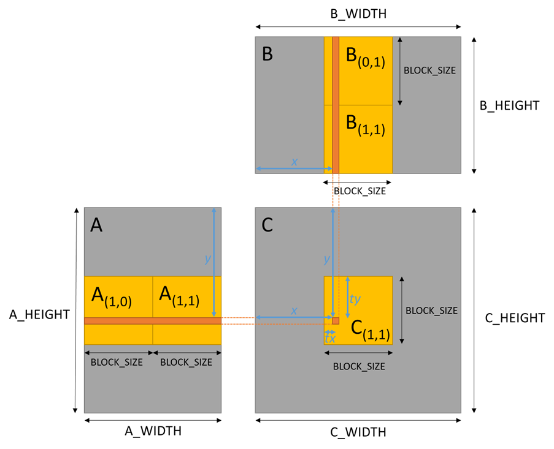
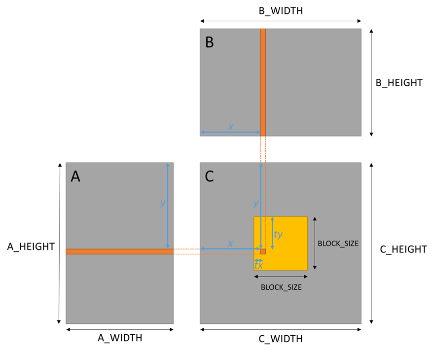
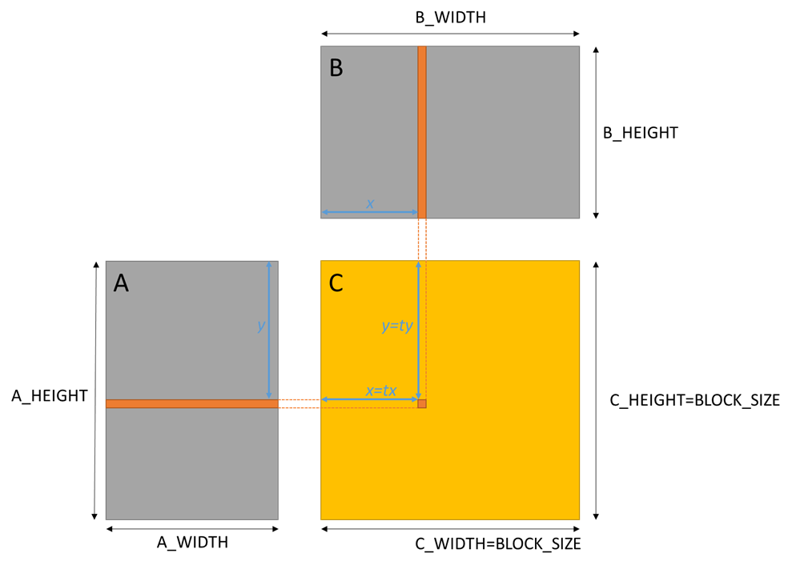

---
title: "Lab 6 - Shared Memory"
author:
- \small COM4521/COM6521 - Parallel Computing with Graphical Processing Units (GPUs)
keywords:
- Lab
- COM4521
- COM6521
- University of Sheffield
subject: |
    COM4521/COM6521 Lab Sheet 6
lang: en-GB
colorlinks: true
...

# Code

* [Starting Code](https://github.com/RSE-Sheffield/COMCUDA_labs/archive/Lab06_src.zip)
* [Solution](https://github.com/RSE-Sheffield/COMCUDA_labs/archive/Lab06_sln.zip)

# Learning Outcomes

*   Understand how to use shared memory to improve performance of a memory bound algorithm (matrix multiply)
*   Understand how to use tiling in shared memory for matrix multiply
*   Understand how to manually calculate occupancy of a kernel at runtime
*   Demonstrate how to automatically discover the thread block size which achieves highest occupancy

# Prerequisites

Open the CUDA occupancy calculator within NSight Compute (this is a standalone CUDA profiler, distinct from Visual Studio's NSight debugger). 

If you create a new project within NSight Compute, there is an option to make an occupancy calculator project.
You do not need to specify an occupancy calculator file, unless you are loading an earlier occupancy calculator instance.

# Exercise 1 (Part 1)

{#fig:matmul1}

For exercise 1 we are going to modify an implementation of matrix multiply (provided in `exercise01_rows.cu`). The implementation provided multiplies a Matrix A by a Matrix B to produce a Matrix C. The widths and heights of the matrices can be modified but for simplicity must be a factor of the `BLOCK_SIZE` (which has been predefined as a macro in the code). The implementation is currently very inefficient as it performs `A_WIDTH x B_HEIGHT` memory loads to compute each product (value in matrix C). To improve this we will implement a blocked matrix multiply which uses CUDAs shared memory to reduce the number of memory reads by a factor of `BLOCK_SIZE`. First note the performance of the original version and then modify the existing code to perform a blocked matrix multiply by implementing the following changes.

To implement a blocked matrix multiply will require that we load `NUM_SUBS` square sub matrices of the matrix A and B into shared memory so that we can compute the intermediate result of the sub matrix products. In the example Figure \ref{fig:matmul1} the sub matrix \begin{math}C_{(1,1)}\end{math} can be calculated by a square thread block of `BLOCK_SIZE` by `BLOCK_SIZE` where each thread (with location `tx`, `ty` in the square thread block) performs the following steps which requires two stages of loading matrix tiles into shared memory.

1.  Load the two sub-matrices \begin{math}A_{(1,0)}\end{math} and \begin{math}B_{(0,1)}\end{math} into shared memory. For these sub matrices each thread should
    1.  Load an element of the sub matrix \begin{math}A_{(1,0)}\end{math} into shared memory from the matrix A at position `(ty+BLOCK_SIZE, tx)`
    2.  Each thread should load an element of the sub matrix \begin{math}B_{(0,1)}\end{math} into shared memory from the matrix B at position `(ty, tx+BLOCK_SIZE)`
    3.  Synchronise to ensure all threads have completed loading sub matrix values to shared memory
2.  Compute the dot product of each row in sub-matrix \begin{math}A_{(1,0)}\end{math} with each column in the sub-matrix \begin{math}B_{(0,1)}\end{math}, storing the result in a local variable. Achieved through the following steps.
    1.  Iterate from `0` to `BLOCK_SIZE` to multiply row `ty` of \begin{math}A_{(1,0)}\end{math} (from shared memory) by column `tx` of \begin{math}B_{(0,1)}\end{math}) (from shared memory) to calculate the sub matrix product value.
    2.  Store the sub matrix product value in a thread local variable.
    3.  Synchronise to ensure that all threads have finished reading from shared memory.
3.  Repeat steps 1 & 2 for the next sub-matrix (or matrices in the general case), adding each new dot product result to the previous result. For the example in the figure, there is only one more iteration required to load the final 2 sub matrices. E.g. 
    1.  Load an element of the sub matrix \begin{math}A_{(1,1)}\end{math} into shared memory from Matrix A at position `(ty+BLOCK_SIZE, tx+BLOCK_SIZE)`
    2.  Load an element of the sub matrix \begin{math}B_{(1,1)}\end{math} into shared memory from matrix B at position `(ty+BLOCK_SIZE, tx+BLOCK_SIZE)`
    3.  Synchronise to ensure all threads have completed loading sub matrix values to shared memory
    4.  Iterate from `0` to `BLOCK_SIZE` to multiply row `tx` of \begin{math}A_{(1,1)}\end{math} (from shared memory) by column `ty` of \begin{math}B_{(1,1)}\end{math} (from shared memory) to calculate the sub matrix product value.
    5.  Add this sub matrix product value to the one calculated for the previous sub matrices.
4.  Store the sum of the sub-matrix dot products into global memory at location `x, y` of Matrix C.


Following the approach described for the example in Figure \ref{fig:matmul} modify the code where it is marked *TODO* to support the general case (any sizes of A and B which are a multiple of `BLOCK_SIZE`). Test and benchmark your code compared to the original version. Do not worry about shared memory bank conflicts until you have implemented your code (it is unlikely that you have introduced any). Once you have a working solution see if you can understand what the stride of your accesses is to understand why your memory access pattern is conflict free. Any shared memory bank conflicts can be resolved by either inverting the storage of your shared memory tiles or by padding your shared memory storage.

*Note: When building in release mode the CUDA compiler often fuses a multiply and add instruction which causes an improvement in performance but some small loss of accuracy. To ensure that you test passes you should either:*

a.  *Implement a small epsilon value and compare the difference of the host and device version to this to ensure that it is within an acceptable range.*
b.  *Modify the `nvcc` flag to avoid the use of fused multiply and add with `–fmad=false`.*

# Exercise 1 (Part 2)

We would like to know the occupancy of the matrix multiply example. We can calculate the theoretical occupancy through the following formula (which will not include the effect of any limitations of the availability of shared memory):

\begin{equation}
Occupancy=\frac{maxBlocksPerMultiProcessor\:\times\:TPB}{maxThreadsPerMultiProcessors\:\times\:multiProcessorCount}
\end{equation}


Where \begin{math}TPB\end{math} is threads per block and \begin{math}maxBlocksPerMultiProcessor\end{math} and \begin{math}maxThreadsPerMultiProcessors\end{math} can be queried from the device properties ([structure docs](https://docs.nvidia.com/cuda/cuda-runtime-api/structcudaDeviceProp.html)).

1.  Calculate the occupancy of the kernel and print it to the console.
2.  Modify the build arguments to output the register and shared memory usage. You can now calculate the occupancy by considering the impact of the limited amount of shared memory per multi processors within the `CUDA_Occupancy_Calculator.xls` spread sheet. Does this differ from what you have calculated?


# Exercise 2

It would benefit performance to achieve optimal occupancy in our matrix multiplication code. We can do this using the CUDA Occupancy API however our code has a statically defined block size. Make a copy of your code from the previous exercise and make the following changes.

1.  Implement a function (`requiredSM()`) to dynamically calculate shared memory usage based on a given block size. For now use the exiting `BLOCK_SIZE` macro.
2.  Modify the kernel launch to dynamically allocate shared memory for the kernel. Within your kernel you will need to create pointers to the A and B submatrix as the kernel launch will have allocated a single linear block. You will also need to update the indexing of the sub matrices as your shared memory sub matrices are now a 1D array. Test your code using the existing `BLOCK_SIZE` to ensure you have not introduced any errors.
3.  Modify the macro `BLOCK_SIZE` so that it is instead a variable in CUDA constant memory. Calculate the `BLOCK_SIZE` which gives best theoretical occupancy by implementing the following:
    1.  Use the `cudaOccupancyMaxPotentialBlockSizeVariableSMem()` function to find the thread block size with best occupancy ([api docs](https://docs.nvidia.com/cuda/cuda-runtime-api/group__CUDART__HIGHLEVEL.html#group__CUDART__HIGHLEVEL_1g77b3bfb154b86e215a5bc01509ce8ea6)).
    2.  Apply the following formula to ensure that the square root of the thread block size is an integer (e.g. the root has no decimal part) and also a power of two number. 
        \begin{equation}
        ThreadsPerBlock=4^{floor(\frac{log_{e}(ThreadsPerBlock)}{log_{e}(4))}}
        \end{equation}
    3.  Calculate the block size using `sqrt()` function
    4.  Copy the block size to constant memory.
4.  Modify your code to print the block size with the highest occupancy to the console.
5.  Test your code and then build and execute in release mode to compare with the original version with lower occupancy.

\newpage

# Appendix: Matrix Multiplication in CUDA with Shared Memory

This appendix provides explanation as to how to adapt the Lab06 starting code ([link](https://github.com/RSE-Sheffield/COMCUDA_labs/archive/Lab06_src.zip)) to implement a shared memory Matrix Multiplication using CUDA.

{#fig:matmul2}

Exercise 1 asks you to modify an implementation of a naive CUDA matrix multiply (shown in Figure \ref{fig:matmul2}). 

The kernel for this is shown below:

```c++
__global__ void matrixMulCUDA()
{
    // Block index
    int bx = blockIdx.x;
    int by = blockIdx.y;
    int tx = threadIdx.x;
    int ty = threadIdx.y;
    int x = bx*BLOCK_SIZE + tx;
    int y = by*BLOCK_SIZE + ty;

    float Csub = 0;
    // iterate A_WIDTH (same as B_HEIGHT) to calculate the product
    for (int k = 0; k < A_WIDTH; k++){
        Csub += d_A[y][k] * d_B[k][x]; 
    }

    // Store the product value of C matrix
    d_C[y][x] = Csub;
}
```

The kernel is launched using the following two dimensional grid block configuration which will ensure the device has unique thread for each element of the Matrix C:

```c++
dim3 threads(BLOCK_SIZE, BLOCK_SIZE);
dim3 grid(C_WIDTH / BLOCK_SIZE, C_HEIGHT / BLOCK_SIZE);
```

The implementation multiplies the Matrix A (`d_A`) by a Matrix B (`d_B`) storing the result in a Matrix C (`d_C`). All of the Matrices are stored globally on the device as two dimensional arrays. Importantly `A_WIDTH` is always equal to `B_HEIGHT`. 

In this `matrixmulCUDA()` kernel the variables `bx`, `by`, `tx` and `ty` are used to provide shorthand notation for `blockIdx.x`, `blockIdx.y`, `threadIdx.x` and `threadIdx.y` respectively. If we examine the inner loop we can see how the Matrix Multiplication algorithm works.

```c++
for (int k = 0; k < A_WIDTH; k++){
    Csub += d_A[y][k] * d_B[k][x]; 
}
```

The `for` loop will take pairwise elements from a row of A and multiply this with a pairwise element of a column of B at index `k` within the respective row or column. E.g. If we consider (from Figure \ref{fig:matmul2}) the value of Matrix C, at position `x`, `y` (e.g. `d_C[y][x]`) this will be the result of the following pairwise multiplications (where each pairwise multiplication is from a single iteration of the loop):

```c++
d_C[y][x] = 
    d_A[y][0]*d_B[0][x] +                  // k=0
    d_A[y][1]*d_B[1][x] +                  // k=1
    ...
    d_A[y][A_WIDTH-1]*d_B[A_WIDTH-1][x];   // k=A_WIDTH-1
```

In this case the value of `x` and `y` is calculated from threads block and grid identifiers as shown in the kernel. The implementation is currently **very inefficient** as for each element of the Matrix C, each thread will perform `A_WIDTH` global memory loads from both the Matrix A and B.

If you are still unclear at this stage about how the starting code works, then you should seek further help or read up yourself on the [Matrix Multiplication algorithm](https://en.wikipedia.org/wiki/Matrix_multiplication).

## A Single Block Shared Memory Implementation of Matrix Multiplication

{#fig:matmul3}

From the initial implementation we can deduce the following:

1.	Each thread performs a large number of global memory loads.
2.	Elements of each row in A and each column in B are loaded multiple times. E.g. every element of Matrix C with a common x position will load the same entire row from Matrix A.
3.	Shared memory could be used to allow threads to work together to minimise the number of global memory load. E.g. a block wise approach could be taken where threads co-operate to load values into shared memory.

Before explaining the tiled matrix multiplication approach given in the lab solution first we will consider a simple approach for very small matrices. In the case of very small matrices we can simplify the problem by implementing a single block version of the code (where only a single block of threads will be launched using the following configuration):

```c++
dim3 threads(C_WIDTH, C_HEIGHT);
dim3 grid(1, 1);
```

This can be represented by the following diagram in Figure \ref{fig:matmul3} where the `BLOCK_SIZE` is equal to the square dimensions of Matrix C (e.g. `BLOCK_SIZE==C_WIDTH==C_HEIGHT`).


In the case of a single block implementation we can move the entirety of Matrix A and B into shared memory. Each thread in the block would be responsible for moving at most a single element of the Matrix A and Matrix B. E.g. 

```c++
__global__ void matrixMulCUDASingleBlock()
{
    __shared__ float As[A_HEIGHT][A_WIDTH];
    __shared__ float Bs[B_HEIGHT][B_WIDTH];

    int x = threadIdx.x;
    int y = threadIdx.y;

    // Each thread load at most a single an element of A and B
    if (x < A_WIDTH) {
        As[y][x] = d_A[y][x];
    }
    if (y < B_HEIGHT) {
        Bs[y][x] = d_B[y][x];
    }
    // Sync to ensure each matrix is fully loaded into shared memory
    __syncthreads();

    // Sum pairwise products of Matrix A and Matrix B
    float C = 0;
    for (int k = 0; k < A_WIDTH; ++k)
    {
        C += As[y][k] * Bs[k][x];		
    }

    // Store the product value in matrix C
    d_C[y][x] = C;
}
```

In the above implementation enough shared memory is allocated for the entire Matrix A and the entire Matrix B. Each thread in the block is responsible for loading at most a single element of Matrix A and a single element of Matrix B into shared memory. A check is required to ensure that the x position does not exceed the width of Matrix A and that the y position does not exceed the height of B. If both A and B were square matrices then each thread would load exactly one value from each of the matrices (A and B). After loading a value into shared memory a call to `__syncthreads()` is made. This ensure that all warps which represent the thread block have reached the same position in the program. Without this call some warps may begin reading from areas of shared memory which have not yet been populated by threads in other warps. The inner loop of the kernel now performs the pairwise calculations by only reading from shared memory. The number of global memory reads has been significantly reduced as each thread is now loading values (into shared memory) which are used by other threads in the block.


## A Tiled Block Shared Memory Implementation of Matrix Multiplication

{#fig:matmul4}

The single block version of the matrix multiply has the following problems:

a.  It relies on a single block of threads which will obtain very poor device utilisation. Only a single streaming multiprocessor will be used to execute the block and the rest will be idle.
b.  The implementation is only suitable for very small matrices. Shared memory is a limited resource (much more limited that GPU global memory) and as such it is not possible to load the entire Matrix A and B for larger matrix sizes.

An alternative solution is required which is able to use multiple thread blocks to calculate the Matrix C but still utilise shared memory to reduce the number of global memory reads. A tiled matrix multiply can achieve this by breaking down the matrices into tiled chunks.^[We will assume for simplicity that the width of Matrix B and the height of Matrix A are also divisible by `BLOCK_HEIGHT`.] As with the naive implementation we can launch a grid of thread block which partitions the matrix C into tiles of `BLOCK_SIZE` by `BLOCK_SIZE` through the following grid block configuration.

```c++
dim3 threads(BLOCK_SIZE, BLOCK_SIZE);
dim3 grid(C_WIDTH / BLOCK_SIZE, C_HEIGHT / BLOCK_SIZE);
```

If we consider the data which is required by a single thread block to calculate all of the blocks values of Matrix C it will correspond to a number of square tiles (the same size as the thread block) from the Matrix A and Matrix B. E.g. If we consider a block size which is \begin{math}\frac{1}{2}\end{math} of `A_WIDTH` (and `B_HEIGHT`) as shown in Figures \ref{fig:matmul2} and \ref{fig:matmul3} then we can describe the problem with Figure \ref{fig:matmul4}.

Figure \ref{fig:matmul4} shows that all of the data required to calculate the values of Matrix C within the grid block (or tile location) \begin{math}C_{(1,1)}\end{math} is located within the tiles \begin{math}A_{(1,0)}\end{math} and \begin{math}A_{(1,1)}\end{math} of Matrix A and \begin{math}B_{(0,1)}\end{math}) and \begin{math}B_{(1,1)}\end{math} of Matrix B. In order to perform the pairwise multiplications, we can consider a single tile from each of Matrix A and B in isolation and sum this with the results of other tile calculations. E.g. From Figure 3 consider the calculation of the value of `C[y][x]`.  This requires a loop (of `BLOCK_SIZE`) through each pair of tiles (\begin{math}A_{(1,0)}\end{math} with \begin{math}B_{(0,1)}\end{math}) and \begin{math}A_{(1,1)}\end{math} with \begin{math}B_{(1,1)}\end{math}).

The code for this calculation can be summarised as:

```c++
float CSum = 0;
// Tiles A(1,0) and B(0,1)
for (k = 0; k < BLOCK_SIZE-1; ++k) {
    CSum += A_1_0[ty][k] * B_0_1[k][tx]
}
// Tiles A(1,1) and B(1,1)
for (k = 0; k < BLOCK_SIZE-1; ++k) {
    CSum += A_1_1[ty][k] * B_1_1[k][tx]
}

C[y][x] = CSum;
```

To implement this as a CUDA kernel each thread block should loop through the number of tile pairs (There will always be `A_WIDTH` / `BLOCK_SIZE` pairs of tiles to consider) and perform the following tasks:

1.  Load a subtitle of Matrix and A and B into shared memory.
2.  Synchronise to ensure the memory loads are complete.
3.  Sum the products of the pairwise elements over range of 0 to `BLOCK_SIZE`.
4.  Sum the resulting value with the results from other tile pairs.

The resulting CUDA kernel can therefore be written as:

```c++
__global__ void matrixMulCUDASharedMemory()
{
    __shared__ float As[BLOCK_SIZE][BLOCK_SIZE];
    __shared__ float Bs[BLOCK_SIZE][BLOCK_SIZE];

    // Block index
    int bx = blockIdx.x;
    int by = blockIdx.y;
    int tx = threadIdx.x;
    int ty = threadIdx.y;

    float CSum = 0;

    // Loop over number of tiles
    for (int i = 0; i < A_WIDTH/BLOCK_SIZE; i++){
        // Calculate indices of A and B matrix to load into shared memory
        int a_x = (i*BLOCK_SIZE) + tx;
        int a_y = (by*BLOCK_SIZE) + ty;
        int b_x = (bx*BLOCK_SIZE) + tx;
        int b_y = (i*BLOCK_SIZE) + ty;

        // Load into shared memory
        As[ty][tx] = d_A[a_y][a_x];		
        Bs[ty][tx] = d_B[b_y][b_x];		

        // Sync to ensure matrix tiles are fully loaded
        __syncthreads();

        // Sum products of A and B matrix tiles
        for (int k = 0; k < BLOCK_SIZE; ++k)
        {
            CSum += As[ty][k] * Bs[k][tx];
        }

        // Sync to prevent blocks modifying shared memory
        __syncthreads();
    }

    // Store the result in matrix C
    int c_x = (bx*BLOCK_SIZE) + tx;
    int c_y = (by*BLOCK_SIZE) + ty;
    d_C[c_y][c_x] = CSum;
}
```

Note how within the loop over the tiles, the value of `a_x` and `b_y` varies whilst the values of `a_y` and `b_y` are constant.
