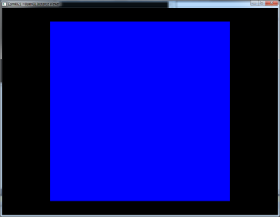
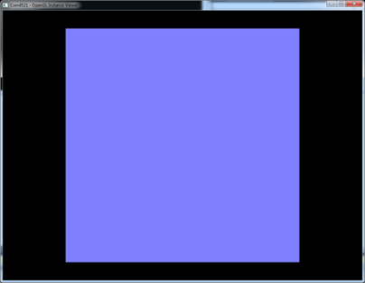
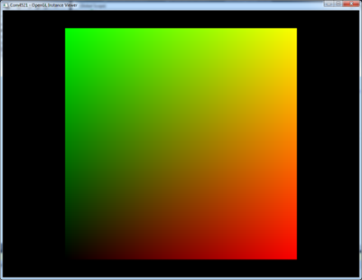
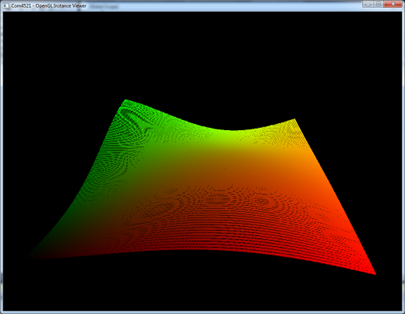

---
title: "(Optional) Lab 10 - CUDA & OpenGL Interop"
author:
- \small COM4521/COM6521 - Parallel Computing with Graphical Processing Units (GPUs)
keywords:
- Lab
- COM4521
- COM6521
- University of Sheffield
subject: |
    COM4521/COM6521 Lab Sheet 10
lang: en-GB
colorlinks: true
...

# Code

* [Starting Code](https://github.com/RSE-Sheffield/COMCUDA_labs/archive/Lab10_src.zip)
* [Solution](https://github.com/RSE-Sheffield/COMCUDA_labs/archive/Lab10_sln.zip)

# Learning Outcomes

*   Understand the relationship between CUDA and OpenGL memory
*   Demonstrate how to map memory from OpenGL Buffers to CUDA device memory
*   Demonstrate the instancing technique to vary the colour and position of vertices
*   Demonstrate how GLSL shaders can be used to apply per vertex transformations

# Prerequisites

This is an advanced lab session for people who have previously had some experience is OpenGL programming either through COM3503/4503/6503 3D Computer Graphics or similar. The learning outcomes in this lab are not assessed as part of the module but they will help you to understand the code provided to you for visualising your assignment work.

*Note: This Lab cannot currently be completed on HPC systems as real-time visualisation requires interactive work with the GPU.*

# Background

OpenGL is an API for 3D computer graphics and rending. It allows geometry to be passed to the GPU for 3D rendering through a series of draw calls which manipulate the GPU. In older hardware the GPU had a fixed function pipeline however modern day GPUs are unified meaning that the processors are used for both Rendering (by implementing the graphics pipeline) and for GPU computing through languages like CUDA. GPU memory is hence unified for both graphics and CUDA computing although it is exposed to the programmer in different ways. Because memory is unified there is the opportunity to perform rending on data which has been computed in CUDA with very little overhead. This can avoid the process of moving data to the CPU from CUDA device memory to then pass it back to the rendering pipeline in draw calls.

In order to avoid moving CUDA data back from the device requires that we use modern OpenGL functionality to avoid issuing OpenGL immediate calls on data (e.g. `glVertex3f()`). In modern OpenGL memory is allocated to the graphics pipeline using the concept of Buffer Objects (BOs). Buffer objects may represent Array Buffer (for vertex, vertex attribute or normal data), Texture Buffer (for texture data) or other buffers (such as Pixel and Frame Buffers). To expose BOs to CUDA requires the CUDA OpenGL interop library which are exposed throughout this lab class.

A simple C library has been provided to you for this lab class which abstracts much of the OpenGL rendering processes. You should familiarise yourself with this code (especially the header which is documented using the Doxygen comments format).

# Exercise 1

The purpose of this lab class is to demonstrate a technique called OpenGL instancing. Instancing is frequently used in situations where you have scenes with lots of similar geometry (a crowd or particle system for example). In this case each item (e.g. person) in the scene has different properties such as location, colour or animation. 

If we want to render large number of items in the scene then traditionally (using OpenGL immediate mode) we would have to make many draw calls and move lots of data to the GPU. This would be very bad for performance. Instead with instancing we describe our geometry by attaching a unique identifier to each instance’s rendering pipeline. The unique identifier represents an object identifier for the unique instance (e.g. a single person within a crowd). This unique identifier can be used to access the information about the unique object and perform some per vertex transformation. The transformation may, for example, be used to move the position or change the colour of the vertex. As each vertex of the geometry for a unique instance has the same set of transformations applied, the approach has the effect of moving (or changing the colour of) the whole object represented by the instance.

To understand how this is implemented take a look at the `displayLoop()` function within `OpenGLInstanceViewer.c`. The execution steps can be summarised as follows:

a.  Call a user defined function which will update the instance data (this will be our CUDA update)
b.  Clear the scene and prepare for rending. 
c.  Perform a set of transformations which come from user interactions with the mouse
d.  Bind an OpenGL vertex shader to perform the vertex transformations
e.  Bind a Vertex Array Object (VAO). This VAO has a number of pre-defined buffers assigned (or bound in OpenGL terms) to it which are allocated on the GPU (see the `initVertexData()` function for the details) containing:
    a.  A Vertex Array Buffer Object which contains all of the vertex locations (the model geometry) for all of our instances.
    b.  A Vertex Attribute Array Buffer Object which contains for each vertex the unique instance identifier.
f.  Bind and activate a texture which is bound to the Texture Buffer Object (TBO). This TBO will be our method of communication between OpenGL and CUDA. There will be four floating point values available for the instance data which will be stored in the RGBA components of the texture.
g.  Draw the vertex and vertex attribute data bound to the VAO using the attached vertex program which can access the bound texture.

To complete this lab we will need to complete some sections of the `exercise01.cu` source file. The provided source file configures the instance objects to be a set of quads (four unique vertices each). The `setVertexInstanceData()` function associates each vertex created with the `setVertexData()` function with a unique identifier. The program also registers a CUDA `cudaGraphicsResource` to the TBO by calling `cudaGraphicsGLRegisterBuffer()` in the main function.

Compile and execute the program. You should get only a blue quad like in Figure \ref{fig:image1}. This is because the provided GLSL shader sets the red and green components of the vertices based on the instance data. Currently the `executeSimulation()` function does not use CUDA to update the instance data. We will change this by completing the following changes within the `executeSimulation()` function. 

{#fig:image1}

1.  Implement a call to `cudaGraphicsMapResources()` it should have the following two arguments;
    1.  The number of resources to map. In this case 1.
    2.  The address of the pointer to the `cudaGraphicsResource` called `cuda_tbo_resource`.
2.  Implement a call to `cudaGraphicsResourceGetMappedPointer()` with the following three arguments;
    1.  The address of the `dptr` pointer cast as an address to a void pointer. This pointer will be used to map the TBO to CUDA device memory.
    2.  A pointer to the `unsigned int` called `num_bytes`. This value will be filled with the number of bytes which were allocated to the TBO. You should perform a check on this value once returned to ensure that it matches the number of instances (problem grid size) × 4 (the RGBA or XYZW components of the TBO) × `sizeof(float)`.
3.  Call the `simple_instance_kernel()` by defining a suitable grid and block size. The first argument to the kernel should be the mapped pointer `dptr`.
4.  Implement a call to `cudaGraphicsUnmapResources()` with the following arguments;
    1.  The number of resources to un-map. In this case 1.
    2.  The address of the pointer to the `cudaGraphicsResource` called `cuda_tbo_resource`.

Compile and execute your program. You should now see a lilac quad like in Figure \ref{fig:image2}. The output of the instancing kernel is being read in the GLSL shader and combined with the existing blue component to produce this colour.

*Note: It is possible to call `cudaGraphicsResourceGetMappedPointer()` only a single time between `cudaGraphicsMapResources()` and `cudaGraphicsUnmapResources()`. In this case you would make the call within your initialisation code. The device pointer will remain valid until the CUDA graphics resource is un-registered.*

{#fig:image2}

5.  Try varying the red and green components in the CUDA kernel by varying the values across the grid using the kernels `x` and `y` values. The colours components should be normalised by using the `width` and `height`. Remove the blue component by editing the GLSL shader so that it uses the `z` value of the instance data. You should now have individually rendered quads like in Figure \ref{fig:image3} which will produce a smooth coloured surface. 

{#fig:image3}

6.  We will now animate the grid by calculating a displacement value for each quad instance based on a simple sin/cos wave. Implement the following equation saving the displacement value in the w component of the mapped `instance_data`:

    \begin{equation}
    displacement=sin(red \times freq+time) \times cos(green \times freq \times time) \times H
    \end{equation}

    Use a `freq` of `4` and an `H` value of `0.1`. 
    
    *Note: Use CUDAs `sinf()` and `cosf()` functions for efficiency. *

7.  Update the GLSL shader so that the `z` position of the quads is offset by the calculated displacement value (ensure this happens before the model view projection matrix is applied). You should produce an animated scene similar to in Figure \ref{fig:image4}.

{#fig:image4}

# Additional Reading

If you are interested in learning more about CUDA OpenGL interop then you should check out the SDK examples. The `bindlessTexture` example shows how to bind CUDA memory directly to read only texture objects.
